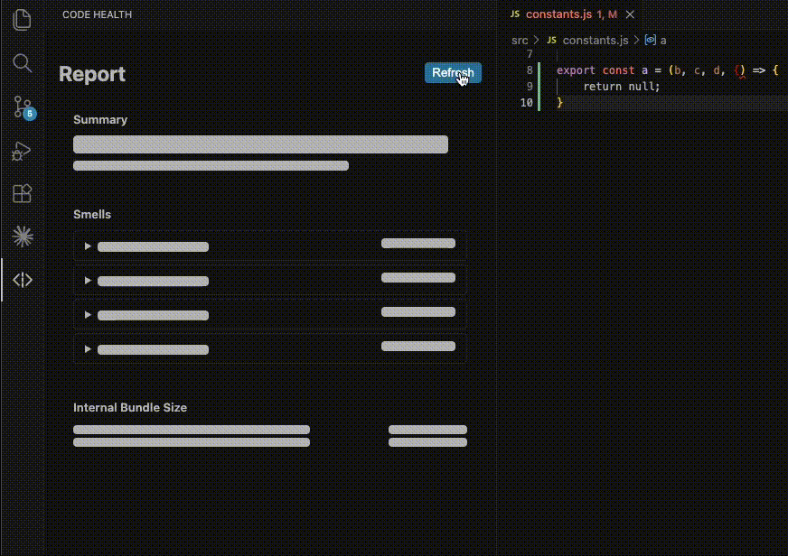

## Code Health - Prevent Software Entropy

> Your ultimate code health visibility tool to help prevent software entropy.

Code Health is a powerful open-source extension for Visual Studio Code that enhances your visibility of code smells while you develop.

## Requirements

- A VS Code workspace with at least one `tsconfig.json` or `jsconfig.json`
- TypeScript or JavaScript project (monorepos with per-package tsconfigs are supported)

## Getting Started

Install Code Health by clicking install on the banner above, or from the extensions side bar in VS Code by searching for Code Health.

## Features

- **Monitor overall codebase health** with the healthbar that tracks how much of your code smells unwell.
- **Drill-down to unwell code** with the list of smells grouped by smell type and file.

### Detected Code Smells

| Smell | What it catches | Powered by |
|---|---|---|
| **Dead code** | Unused exports and unresolved imports | [Fallow](https://github.com/fallow-rs/fallow) + TypeScript compiler |
| **Duplicate code** | Identical or near-identical blocks duplicated across files | [Fallow](https://github.com/fallow-rs/fallow) |
| **Long parameter lists** | Functions exceeding the maximum parameter count | [Oxlint](https://oxc.rs/docs/guide/usage/linter) |
| **Barrel files** | Index files that only re-export from other modules, degrading build performance and tree-shaking | TypeScript AST |

_Note: Some results may be false positives. Use your judgement before acting._

## Configuration

| Setting | Type | Default | Description |
|---|---|---|---|
| `codehealth.entry` | `string[]` | `[]` | Entry point file paths (glob patterns) passed to fallow for dead code analysis. Exports in these files are treated as used, so fallow won't report them as unused. |

## Issue Reporting and Feature Requests

Found a bug? Have a feature request? Reach out on our [GitHub Issues page](https://github.com/KaitlynParsons/code-health/issues).